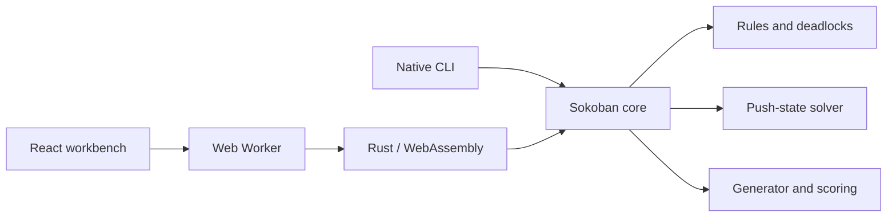

<h1 align="center">SokoForge</h1>

<p align="center">
  Design Sokoban levels, prove shortest-push solutions, and forge compact puzzles built around delayed traps.
</p>

<p align="center">
  <a href="https://soko-forge-web.vercel.app"><strong>Open the workbench</strong></a>
  · <a href="README.zh-CN.md">中文</a>
  · <a href="#solver-and-generator">Algorithms</a>
  · <a href="#native-cli">CLI</a>
  · <a href="#deployment">Deploy</a>
</p>

<p align="center">
  <a href="https://github.com/huluhuluu/SokoForge/actions/workflows/ci.yml"></a>
  <a href="LICENSE"></a>
  
  
</p>

<p align="center">
  <a href="https://soko-forge-web.vercel.app">
    
  </a>
</p>

SokoForge is a bilingual, local-first Sokoban workbench. It combines a visual editor and playable level library with a Rust solver that runs in a browser Worker through WebAssembly. For larger searches, the same core is available through a parallel native CLI.

The project focuses on a specific problem: generating small boards that remain difficult because the correct idea is hidden, not because the map is enormous.

## Why SokoForge

| Design | Solve | Forge |
| --- | --- | --- |
| Edit boards from `5x5` to `20x20`, play immediately, and import or export standard XSB. | Find a quick solution or prove the minimum number of pushes, then inspect it step by step. | Generate batches, certify each finalist with the optimal solver, and rank delayed traps and ordering constraints. |

- **Ready to play:** 16 introductory levels and 200 compact expert levels are bundled with the static site.
- **Transparent results:** solved, unsolved, timed-out, feasible, and optimal results are reported separately.
- **Local by default:** levels and completion records stay in the browser; no account, database, API key, or server is required.
- **One algorithmic core:** the web app, WASM interface, and CLI share the same Rust rules, difficulty metrics, and certification gates.
- **Practical controls:** undo, restart, keyboard and touch input, plus pause, step, and `0.5x`-`4x` solution replay.

## Quick Start

Requirements: [Node.js 24+](https://nodejs.org/) and npm. Rust stable is only required when rebuilding the solver or using the CLI.

```bash
git clone https://github.com/huluhuluu/SokoForge.git
cd SokoForge
npm ci
npm run dev
```

Vite prints the local URL. The repository includes a reviewed browser WASM build, so frontend development can start without compiling Rust.

To rebuild everything from source:

```bash
rustup target add wasm32-unknown-unknown
npm run build
```

## How It Fits Together



| Layer | Responsibility |
| --- | --- |
| `web/` | React UI, editor, gameplay, replay, local packs, and static published levels |
| `sokoforge-core` | XSB parsing, movement rules, deadlock detection, search, generation, and scoring |
| `sokoforge-wasm` | Small JSON boundary used by the browser Worker |
| `sokoforge-cli` | Parallel offline generation and command-line solving |

CPU-heavy browser work stays off the UI thread. Starting a new solve, loading a level, or leaving Forge cancels stale Worker work instead of allowing old results to overwrite the current board.

## Solver and Generator

### Solver

The solver searches **push states** rather than every player step:

1. Flood fill computes the player's reachable region.
2. A* expands only legal box pushes.
3. Reverse-push tables reject static dead squares and provide wall-aware box-to-goal distances.
4. Minimum box-goal matching and a two-box pattern database provide admissible lower bounds.
5. In shortest-solution mode, finishing the search proves the minimum push count.

Sokoban search still grows exponentially. A timeout is not reported as proof that a board is unsolvable, and a feasible result is never presented as optimal without completing the proof.

### Generator

Generation starts from a solved board and performs legal reverse pulls, which guarantees a forward solution before certification. Candidate selection favors behaviors that are often difficult for a human to plan:

- temporarily moving a box away from its goal;
- reopening a box that was already on a goal;
- false goals and shared turning squares;
- box-order dependencies, role swaps, and tunnel commitments;
- wrong pushes whose consequence appears several pushes later.

The native pipeline also evolves wall geometry and uses novelty selection to avoid batches of near-identical boards. Finalists are solved again in optimal mode, then ranked using push count, dependency, trap, delayed-regret, and diversity signals.

| Tier | Certification gate |
| --- | --- |
| Simple | At most 10 optimal pushes |
| Medium | 8-18 optimal pushes |
| Hard | At least 16 optimal pushes, plus both a deep-lure and an ordering/dependency signal |

The 200 expert levels are unique `9x9`-`11x11` boards with 4-5 boxes and 16-35 proven optimal pushes. These metrics are useful filters, not a claim that every player experiences difficulty identically.

## Native CLI

Solve an XSB file:

```bash
cargo run -p sokoforge-cli -- solve level.xsb --time-limit-ms 30000
```

Generate and retain the best 50 maps from 5,000 candidates:

```bash
cargo run -p sokoforge-cli --release -- generate \
  --count 5000 --width 10 --height 10 --boxes 4 \
  --mode composite --tier hard --seed 42 --top 50 \
  --evolution-rounds 100 --finalist-time-limit-ms 60000 \
  --output pack.json
```

Import `pack.json` from the web app's Library tab. Use the native CLI for large batches; browser generation is intentionally sized for interactive exploration.

## Level Files

| Format | Purpose |
| --- | --- |
| `.xsb` | One standard Sokoban board |
| `sokoforge-level-pack` JSON | Portable user/generated levels, metrics, metadata, and optional solutions |
| `sokoforge-published-pack` JSON | Bundled static collections loaded from the published-level index |

The Library imports multiple JSON/XSB files at once. Chromium can also remember a user-selected level folder through the File System Access API. Firefox and Safari use normal download and multi-file import because they do not expose the same directory API.

<details>
<summary><strong>Publish levels with the static site</strong></summary>

Small collections can add XSB files under `web/public/levels/` and metadata to `web/public/levels/index.json`. Large collections should use a `sokoforge-published-pack` file referenced by the index's `packs` array to avoid hundreds of startup requests.

Verify every submitted level first:

```bash
cargo run -p sokoforge-cli -- solve web/public/levels/my-level.xsb --time-limit-ms 30000
```

Static packs are reviewed in Git and cached by Vercel; no publishing backend is necessary.
</details>

## Development

```bash
npm run lint                 # rustfmt, Clippy, and TypeScript
npm test                     # Rust and frontend unit tests
npm run build                # release WASM and Vite production build
npm --workspace web run test:e2e
```

GitHub Actions runs all four stages and rejects commits when the tracked WASM artifact differs from the Rust source.

## Deployment

Import this repository into Vercel with these settings:

| Setting | Value |
| --- | --- |
| Framework preset | Vite (auto-detected) |
| Root Directory | `web` |
| Build and Output Settings | Defaults |
| Environment Variables | None |

Vercel builds only the static frontend and serves `web/dist`. Rust and `wasm-pack` are not needed on the Vercel build machine because the reviewed WASM artifact is committed under `web/public/wasm`.

## Contributing

Issues and pull requests are welcome. For a focused contribution:

1. Keep the web and native paths behaviorally consistent when changing core rules or difficulty gates.
2. Add a regression test for parser, solver, persistence, or Worker lifecycle changes.
3. Run the development checks above before opening the pull request.
4. Do not copy proprietary Sokoban levels, art, or code without a compatible license.

## References

- Richard E. Korf, *Depth-first Iterative-Deepening: An Optimal Admissible Tree Search*.
- Junghanns and Schaeffer, *Sokoban: Enhancing General Single-Agent Search Methods Using Domain Knowledge*, Artificial Intelligence, 2001.
- Bento, Pereira, and Lelis, [*Procedural Generation of Initial States of Sokoban*](https://www.ijcai.org/proceedings/2019/646), IJCAI 2019.
- [Sokoban Wiki: Solver](http://www.sokobano.de/wiki/index.php?title=Solver).
- [Festival solver overview](http://www.sokobano.de/wiki/index.php?title=Solver:Festival).

SokoForge is a clean-room implementation released under the [MIT License](LICENSE).
