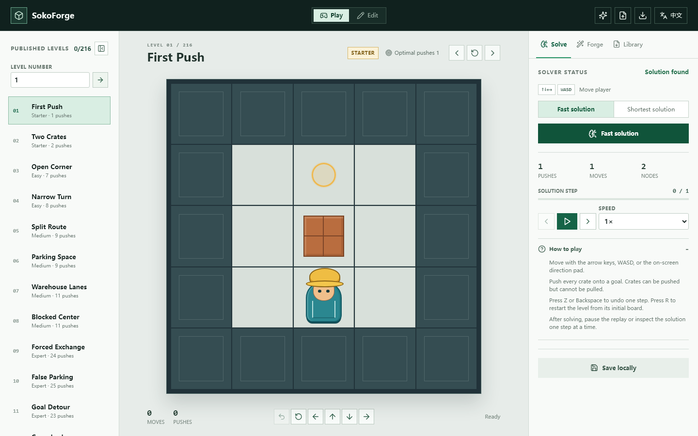
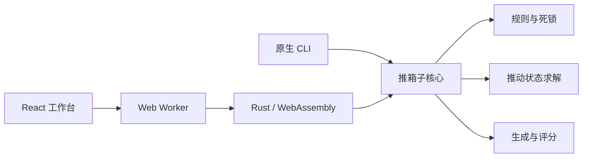

<h1 align="center">SokoForge / 推箱工坊</h1>

<p align="center">
  设计推箱子关卡、证明最少推动解，并生成依靠延迟陷阱而非巨大尺寸制造难度的紧凑地图。
</p>

<p align="center">
  <a href="https://soko-forge-web.vercel.app"><strong>打开在线工作台</strong></a>
  · <a href="README.md">English</a>
  · <a href="#求解与生成">算法</a>
  · <a href="#原生-cli">CLI</a>
  · <a href="#部署">部署</a>
</p>

<p align="center">
  <a href="https://github.com/huluhuluu/SokoForge/actions/workflows/ci.yml"></a>
  <a href="LICENSE"></a>
  
  
</p>

<p align="center">
  <a href="https://soko-forge-web.vercel.app">
    
  </a>
</p>

SokoForge 是一个中英文、本地优先的推箱子工作台。它把可视化编辑器、在线游玩、关卡库与 Rust 求解器放在同一个静态网站中；求解器通过 WebAssembly 在浏览器 Worker 中运行，大规模生成则复用同一套 Rust 核心和原生并行 CLI。

项目关注一个明确的问题：地图不必很大，但正确思路应当被延迟错误、顺序约束和逻辑陷阱隐藏起来。

## 为什么选择 SokoForge

| 设计 | 求解 | 生成 |
| --- | --- | --- |
| 编辑 `5x5` 到 `20x20` 地图，即时游玩，并导入或导出标准 XSB。 | 快速寻找可行解，或证明最少推动数，再逐步查看完整解法。 | 批量生成候选图，用最优求解器认证决赛图，并对延迟陷阱和顺序约束评分。 |

- **打开即可玩：** 静态网站内置 16 个入门关卡和 200 个紧凑专家关卡。
- **结果不含糊：** 已解决、无解、超时、仅可行解和已证明最优解分别显示。
- **默认保存在本地：** 关卡和通关记录留在浏览器，无账号、数据库、API Key 或服务端。
- **同一套算法核心：** 网页、WASM 和 CLI 共用 Rust 规则、难度指标与认证条件。
- **完整游玩控制：** 支持撤销、重开、键盘、触屏，以及暂停、单步和 `0.5x`-`4x` 解法回放。

## 快速开始

需要 [Node.js 24+](https://nodejs.org/) 和 npm。只有在重新编译求解器或使用 CLI 时才需要 Rust stable。

```bash
git clone https://github.com/huluhuluu/SokoForge.git
cd SokoForge
npm ci
npm run dev
```

Vite 会输出本地访问地址。仓库已经包含经过审查的浏览器 WASM 产物，因此只开发前端时不必先编译 Rust。

从源码重新构建全部组件：

```bash
rustup target add wasm32-unknown-unknown
npm run build
```

## 系统结构



| 模块 | 职责 |
| --- | --- |
| `web/` | React 界面、编辑、游玩、回放、本地关卡包与静态发布关卡 |
| `sokoforge-core` | XSB 解析、移动规则、死锁检测、搜索、生成与难度评分 |
| `sokoforge-wasm` | 浏览器 Worker 使用的精简 JSON 接口 |
| `sokoforge-cli` | 原生并行批量生成与命令行求解 |

浏览器中的高计算量任务不会占用 UI 线程。开始新求解、载入关卡或离开生成页面时，旧 Worker 任务会被取消，过期结果不会覆盖当前地图。

## 求解与生成

### 求解器

求解器搜索的是**推动状态**，而不是玩家走过的每一格：

1. 通过 flood fill 计算玩家可达区域。
2. A* 只扩展合法的箱子推动。
3. 反向推动表排除静态死方格，并提供感知墙体的箱子到目标距离。
4. 最小箱子-目标匹配与二箱模式数据库提供可采纳下界。
5. 最短解模式完成搜索时，即证明该地图的最少推动数。

推箱子搜索空间仍会指数增长。超时不会被当作“无解”证明；没有完成最优性证明的可行解，也不会被标记为最优解。

### 生成器

生成从完成状态出发执行合法的反向拉箱，因此认证前就具备一条正向解。候选选择会偏好一些通常不容易靠直觉规划的行为：

- 必须暂时把箱子推离目标；
- 必须重开已经完成的目标；
- 假目标和多个箱子争用的转向格；
- 箱子顺序依赖、角色交换和通道承诺；
- 错误推动在若干步后才暴露代价。

原生生成流程还会进化墙体结构，并通过 Novelty 避免批次中出现大量相似地图。决赛候选会重新进行最优求解，再按照推动数、依赖、陷阱、延迟错误代价和多样性评分排序。

| 难度 | 认证条件 |
| --- | --- |
| 简单 | 最多 10 次最优推动 |
| 中等 | 8-18 次最优推动 |
| 困难 | 至少 16 次最优推动，同时具备深层诱饵和顺序/依赖信号 |

内置 200 个专家关卡均为唯一的 `9x9`-`11x11` 地图，包含 4-5 个箱子，已证明最少推动数为 16-35。这些指标适合筛选地图，但不代表所有玩家的体感难度完全相同。

## 原生 CLI

求解一个 XSB 文件：

```bash
cargo run -p sokoforge-cli -- solve level.xsb --time-limit-ms 30000
```

从 5,000 个候选中生成并保留最好的 50 张地图：

```bash
cargo run -p sokoforge-cli --release -- generate \
  --count 5000 --width 10 --height 10 --boxes 4 \
  --mode composite --tier hard --seed 42 --top 50 \
  --evolution-rounds 100 --finalist-time-limit-ms 60000 \
  --output pack.json
```

在网页“关卡库”中导入 `pack.json`。大批量任务使用原生 CLI；浏览器生成更适合交互式、小批量探索。

## 关卡文件

| 格式 | 用途 |
| --- | --- |
| `.xsb` | 单张标准推箱子地图 |
| `sokoforge-level-pack` JSON | 可移植的私人/生成关卡、指标、元数据和可选解法 |
| `sokoforge-published-pack` JSON | 从发布关卡索引加载的静态关卡集合 |

关卡库可以一次导入多个 JSON/XSB 文件。Chromium 还可以通过 File System Access API 记住用户主动选择的关卡目录；Firefox 和 Safari 没有同等目录接口，因此使用普通下载与多文件导入。

<details>
<summary><strong>把关卡随静态网站发布</strong></summary>

少量关卡可以把 XSB 文件放入 `web/public/levels/`，再向 `web/public/levels/index.json` 添加元数据。大型关卡集应使用索引 `packs` 数组引用的 `sokoforge-published-pack` 文件，避免启动时产生数百个请求。

提交前先验证每张地图：

```bash
cargo run -p sokoforge-cli -- solve web/public/levels/my-level.xsb --time-limit-ms 30000
```

静态关卡包通过 Git 审核并由 Vercel 缓存，不需要发布后端。
</details>

## 开发与检查

```bash
npm run lint                 # rustfmt、Clippy 与 TypeScript
npm test                     # Rust 与前端单元测试
npm run build                # release WASM 与 Vite 生产构建
npm --workspace web run test:e2e
```

GitHub Actions 会重新生成浏览器绑定，检查其文本接口，再使用刚生成的 WASM 执行生产构建和浏览器测试。二进制文件允许因运行器工具链不同而产生字节差异。

## 部署

将仓库导入 Vercel，只需以下设置：

| 设置 | 值 |
| --- | --- |
| Framework Preset | Vite（自动识别） |
| Root Directory | `web` |
| Build and Output Settings | 保持默认 |
| Environment Variables | 无 |

Vercel 只构建静态前端并托管 `web/dist`。经过审查的 WASM 产物已提交到 `web/public/wasm`，因此 Vercel 构建机不需要 Rust 或 `wasm-pack`；CI 会在每次改动中重新构建并测试同一浏览器接口。

## 参与贡献

欢迎提交 Issue 和 Pull Request。为了让改动容易审查：

1. 修改核心规则或难度条件时，保持网页与原生 CLI 的行为一致。
2. 解析、求解、持久化或 Worker 生命周期改动应添加回归测试。
3. 提交前执行上面的开发检查。
4. 不要在许可证不兼容时复制其他推箱子项目的关卡、美术或代码。

## 参考资料

- Richard E. Korf，*Depth-first Iterative-Deepening: An Optimal Admissible Tree Search*。
- Junghanns 与 Schaeffer，*Sokoban: Enhancing General Single-Agent Search Methods Using Domain Knowledge*，Artificial Intelligence，2001。
- Bento、Pereira 与 Lelis，[*Procedural Generation of Initial States of Sokoban*](https://www.ijcai.org/proceedings/2019/646)，IJCAI 2019。
- [Sokoban Wiki：Solver](http://www.sokobano.de/wiki/index.php?title=Solver)。
- [Festival solver 概览](http://www.sokobano.de/wiki/index.php?title=Solver:Festival)。

SokoForge 采用 clean-room 实现，并以 [MIT 许可证](LICENSE)发布。
